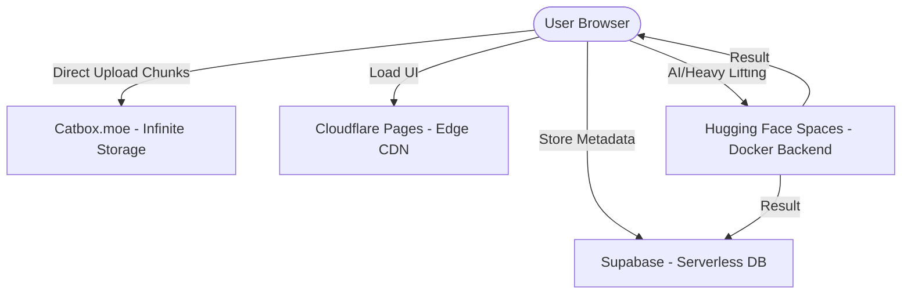

# 🇮🇳 ConnectSphere: The Social Revolution
> **"Zero Cost. Infinite Scale. Original Quality."**

ConnectSphere is an Indian social media platform built for the people, by the people. It follows a unique "Jugaad" architecture that leverages high-performance free-tier tools (Cloudflare, Supabase, Catbox) to provide a premium, scalable, and ₹0 budget social experience.

---

## ✨ Features (Sustainable Architecture)

- **🚀 Chunked Storage**: Upload and play original quality videos up to 500MB+ using client-side chunking. Optimized at 20MB chunks for peak compatibility. 📈
- **💎 Premium Aesthetics**: A sleek, high-end UI featuring **Glassmorphism**, vibrant color palettes, and smooth animations.
- **🤖 Dockerized AI Backend**: A heavy-lifting microservice for speech analytics (WPM, filler word detection) and metadata processing.
- **⚡ Real-time Social**: Instant stories, community chats, and post interactions.
- **📱 PWA Ready**: Installable on any device for a native-like experience.

---

## 🏗️ Architecture Overview



---

## 🛠️ Tech Stack

| Layer | Technology | Philosophy |
| :--- | :--- | :--- |
| **Frontend** | Next.js 14+ (App Router) | Speed & SEO |
| **Styling** | Vanilla CSS + Tailwind | Premium Flexibility |
| **Database** | Supabase (PostgreSQL) | Serverless Reliability |
| **Backend** | Node.js + Docker | AI Heavy Lifting |
| **Storage** | Catbox.moe | Free Original Quality |
| **Deployment** | Cloudflare Pages | Edge Scalability |

---

## 🚀 Quick Start

### 1. Database Setup
1. Create a project on [Supabase.com](https://supabase.com).
2. Run the consolidated master script: `supabase/ultimate_schema.sql` in the SQL Editor. This script is idempotent and contains all necessary tables, indexes, and RLS policies.

### 2. Environment Configuration
- Copy `.env.example` to `frontend/.env.local` and `backend/.env`.
- Fill in your Supabase credentials.

### 3. Run Locally

**Frontend:**
```bash
cd frontend
npm install
npm run dev
```

**Backend:**
```bash
cd backend
npm install
npm start
```

---

## 🌏 The World Is Watching
ConnectSphere isn't just an app; it's a statement. We've proven that with the right "Jugaad", you can build a global-scale platform without a trillion-dollar budget. 

**Connect, Share, and Revolutionize.**
🚀🇮🇳
